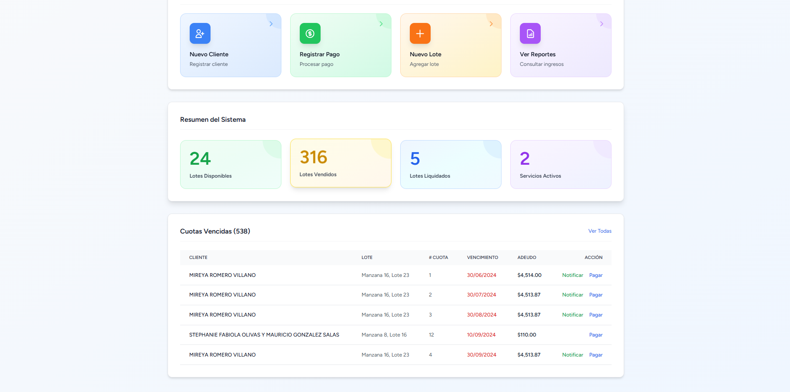
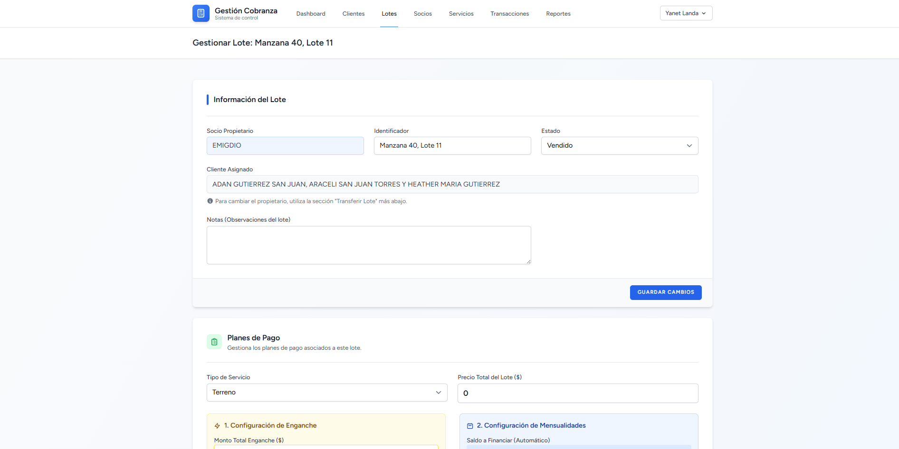
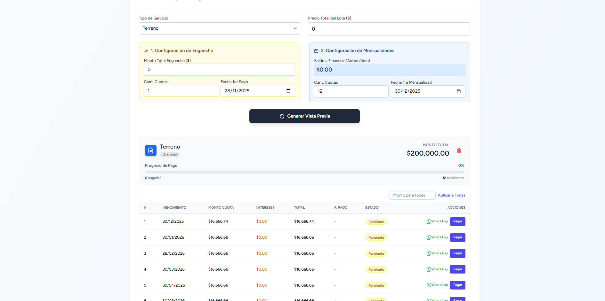
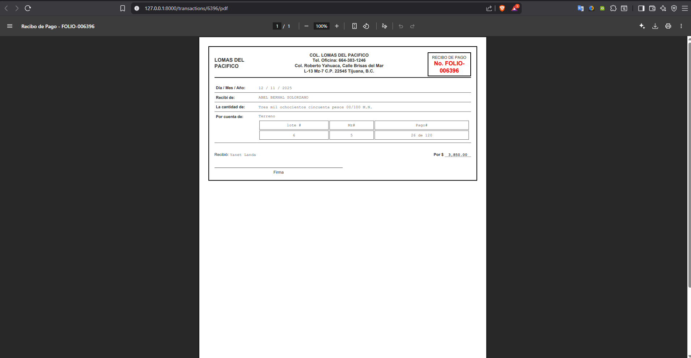

# 🏢 Sistema de Gestión de Cobranza Inmobiliaria


Una plataforma SaaS robusta diseñada para administrar la venta de terrenos, lotes y servicios de electrificación. Este sistema reemplaza flujos de trabajo manuales basados en Excel, automatizando el cálculo de intereses, la generación de recibos y el seguimiento de deudas.

Desarrollado con una arquitectura **Multi-Socio**, permite gestionar carteras de propiedades pertenecientes a distintos dueños dentro de una misma administración.

---

## 📸 Vistas del Sistema

### Dashboard Principal
Vista general con métricas en tiempo real, alertas de cuotas vencidas y accesos rápidos.
 


### Gestión de Planes de Pago y Cuotas
Motor financiero capaz de calcular enganches, mensualidades, intereses por mora y pagos parciales.
 

### Generación de Recibos (Folios)
Generación automática de comprobantes en PDF con desglose de capital e intereses y conversión de montos a letras.



---

## 🚀 Funcionalidades Clave

### 💰 Gestión Financiera Avanzada
*   **Planes de Pago Flexibles:** Creación de planes con lógica de **Enganche (Cuota 0)** + Mensualidades.
*   **Edición Granular:** Posibilidad de ajustar montos y fechas de cuotas individuales o masivamente.
*   **Cálculo de Intereses:** Tarea programada (Cron Job) que detecta vencimientos diarios y aplica automáticamente una tasa de interés (10%) sobre el saldo de capital.
*   **Pagos Parciales:** El sistema acepta abonos parciales, calculando el remanente automáticamente.

### 🏘️ Gestión de Propiedades (Lotes)
*   Organización por **Manzanas y Lotes**.
*   Asignación de **Socios (Dueños)**: Permite filtrar reportes e ingresos según el propietario real del terreno.
*   Historial de transferencias de propiedad (trazabilidad completa).

### 📊 Reportes y Exportación
*   **Estado de Cuenta del Cliente:** Desglose visual de deuda de capital vs. intereses.
*   **Reporte de Ingresos:** Filtrado por rango de fechas y Socio.
*   **Exportación a Excel:** Descarga de reportes contables con formato nativo `.xlsx`. Se pueden descargar los reportes de ingresos y estado de cuenta del cliente.

### ⚡ Herramientas de Productividad
*   **Notificaciones WhatsApp:** Integración "Click-to-Chat" con mensajes pre-redactados para cobrar cuotas vencidas.
*   **Buscadores Inteligentes:** Implementación de `Select2` y filtros en tiempo real para manejar bases de datos de miles de clientes.
*   **Importador Masivo:** Script personalizado (`Artisan Command`) capaz de normalizar y migrar datos históricos desde múltiples archivos Excel inconsistentes.

---

## 🛠️ Aspectos Técnicos Destacados

*   **Arquitectura MVC:** Separación limpia de lógica de negocio y presentación.
*   **Eloquent ORM:** Uso avanzado de relaciones polimórficas y Scopes.
*   **Alpine.js:** Interactividad reactiva en el frontend (cálculos en tiempo real en formularios) sin la sobrecarga de una SPA.
*   **Tailwind CSS:** Diseño responsivo y moderno (Tema Claro implementado).
*   **DomPDF:** Motor de renderizado para documentos legales.
*   **Maatwebsite Excel:** Manejo eficiente de grandes volúmenes de datos para importación/exportación.

---

## ⚙️ Instalación Local

1.  **Clonar el repositorio:**
    ```bash
    git clone https://github.com/BlundaBranco/gestion_cobranza.git
    ```
2.  **Instalar dependencias PHP:**
    ```bash
    composer install
    ```
3.  **Instalar dependencias JS:**
    ```bash
    npm install && npm run build
    ```
4.  **Configurar entorno:**
    ```bash
    cp .env.example .env
    # Configurar base de datos en .env
    php artisan key:generate
    ```
5.  **Migrar y poblar base de datos:**
    ```bash
    php artisan migrate --seed
    ```
6.  **Ejecutar:**
    ```bash
    php artisan serve
    ```

---

**Desarrollado por Blunda Branco**