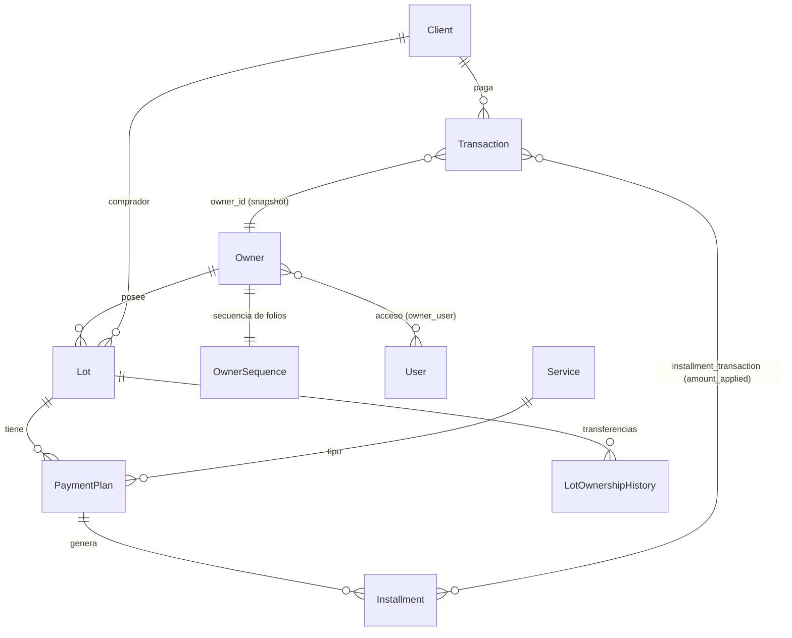

# Arquitectura — Gestión de Cobranza

## Diagrama de dominio



## Flujo de pago (store)

```
Request → validate → DB::beginTransaction
  → crear Transaction (sin folio aún)
  → para cada Installment ordenado por due_date:
      pagar_total = min(pendiente, saldo)
      pivot attach(amount_applied = pagar_total)
      si cubierta: status = 'pagada'
  → derivar ownerId desde firstInstallment.paymentPlan.lot.owner_id
  → OwnerSequence::getNextValue($ownerId)  [lockForUpdate dentro de la tx]
  → transaction.folio_number = FOLIO-XXXXXX
  → transaction.owner_id = ownerId   (snapshot histórico)
  → DB::commit
→ redirect con new_transaction_id
```

## Decisiones arquitectónicas

1. **Folios por Owner, no globales.** Cada Owner (socio) tiene su `OwnerSequence`. Se reserva dentro de la transacción con `lockForUpdate()` para evitar colisiones bajo concurrencia. Razón de negocio: cada socio emite recibos fiscales independientes.

2. **`owner_id` en `transactions` (snapshot).** Columna agregada 2026-04-10. Se guarda al crear la transacción, no se deriva por JOIN. Razón: si el lote se transfiere a otro socio, los pagos históricos deben mantener el socio original.

3. **Installments como fuente de verdad.** El monto pendiente del lote se calcula sumando `base_amount + interest_amount - amount_applied` por cuota, no desde el Plan.

4. **SoftDeletes en Transactions.** `destroy()` ejecuta `updateExistingPivot(amount_applied = 0)` en vez de `detach()`. Preserva la relación para auditoría y permite recuperar el owner desde installments. Cambio histórico: código antiguo usaba `detach()` y esas transacciones perdieron trazabilidad — `owner_id` quedó NULL tras la migración de backfill.

5. **Pagos aplicados en cascada por `due_date` ASC** con tolerancia float `0.001`. Una cuota queda `pagada` cuando `sum(amount_applied) >= base_amount + interest_amount - 0.001`.

6. **Interés: 10% mensual sobre cuotas vencidas.** Calculado por Cron/Artisan Command, persistido en `installments.interest_amount` y `months_overdue`. No se recalcula en el hot path de pago.

## Integraciones externas

- **Producción:** DigitalOcean 137.184.38.230 (`/var/www/gestion_cobranza`), dominio `gestioncobranza.duckdns.org`
- **Deploy:** SSH manual vía paramiko (Python). NUNCA `route:cache`.
- **DB:** SQLite local, MySQL producción. Sessions/cache/queue = database driver.
- **PDF:** barryvdh/laravel-dompdf. **Excel:** Maatwebsite/Excel 4.

## Convenciones críticas
- Idioma: código en inglés, UI y mensajes de cliente en español.
- Alpine.js para cálculos en vivo en formularios; Select2 para dropdowns grandes.
- Modales para bulk update de cuotas y procesamiento de pagos.
